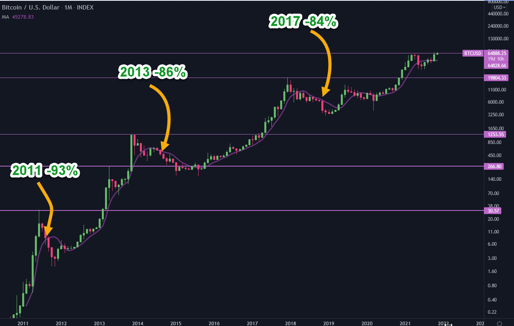

### **分析BTC历史走势有意义吗？**
原文：https://ladyofcrypto.substack.com/p/btc-historical-analysis-whats-the

作者：LadyofCrypto1   写于 2021-11-11

翻译与校正：WorkerOfCrypto.eth  20211201

This is Not Hopium

**我没有吃错药**

When I share this opinion, I am often accused of hopium.

当我分享这一观点时，我常常被指责吃错了药。

The reality is, I would love a crash down to $10k BTC.

其实我真希望比特币能暴跌到1万美元。

I have funds in other assets that I want to use for buying cheap crypto.

由于我在其他资产中有资金，这样我就能用它们来购买更廉价的加密货币。

I am not even arguing that we won’t see a major crash.

我不想争论说我们不会看到暴跌。

I hope we do.

但愿如此。

My argument is that the last three cycles don’t give us enough data for serious statistical analysis, and even if they did, it would not matter.

我认为最近的3个周期并不能提供给我们足够的数据做严肃的统计分析，就算可以，也是没有意义的

Here is why.

这就是原因

There Isn’t Enough Data

**数据不足**

In traditional financial markets, analysis is based on decades of data, because the data exists.

在传统的金融市场中，分析是基于几十年的数据，因为数据是存在的。

How many cycles have we had in Bitcoin before this one?

比特币在这之前经历了多少次周期?

Three. 2011, 2013, 2017.

3次、分别为 2011、2013、2017，见下图：

This is not enough data.

没有足够的数据。

Sit on a park bench and watch cars go by.

坐在公园的长椅上，看着过往的汽车。

The first car you see is red, the second car you see is red, the third is the same.

你看到的第一辆车是红色的，第二辆车是红色的，第三辆也是一样。

Is it safe to assume that the next three will be red?

可以假设接下来的3辆也是红色的吗?

Obviously not.

显然不是。

Is it safe to assume that red is the most popular colour for cars in that town?

可以认为红色是那个镇上最受欢迎的汽车颜色吗?

No.

也不能。

At the very least, can we assume that the next car that drives by will be red?

那么我们可以假设下一辆驶过的车是红色的吗?

No.

不能。

Three data points aren’t enough.

3个数据点是不够的。

In statistical analysis, you require 30 data points, and many argue that 30 is too low.

在统计分析中，你需要30个数据点，并且许多人认为30点太低了。

Basing future predictions on three data points is dangerous.

基于3个数据点来预测未来是危险的。

Market Participants Have Changed

**市场参与者发生了变化**

In 2013 BTC was traded almost exclusively by enthusiasts as the tech barrier for entry was high.

2013年，由于技术门槛很高，BTC几乎完全由狂热者进行交易。

In 2017 BTC was traded by enthusiasts, a handful of institutions, the tech barrier was still high, but it had been lowered allowing more retail money to come in.

2017年，比特币由狂热者和少数机构进行交易，技术壁垒仍然很高，但已经降低，允许更多散户资金进入。

In 2020 BTC has become one of the most recognized and traded assets in the world.

到2020年，BTC已经成为世界上最受认可和交易的资产之一。

Institutional volume outweighs retail.

机构交易量超过了散户。

Anyone with a credit card can max it out on BTC as there is almost no tech barrier.

任何有信用卡的人都可以在BTC上透支，这几乎没有任何技术障碍。

If I am correct and BTC is now driven primarily by institutional investors, then market psychology has shifted.

如果我是对的，BTC现在主要由机构投资者驱动，那么市场心理已经发生了变化。

Institutional investors have different goals from retail investors, and they have the power to manifest those goals by manipulating the narrative in the media.

机构投资者与散户投资者有着不同的目标，他们有能力通过操纵媒体的叙事来实现这些目标。

When the market is no longer driven by retail investors, or by retail whales, the behaviour of the market changes.

当市场不再由散户投资者或大户驱动时，市场行为就会发生变化。

What’s BTC Going To Do?

**BTC会去往何方?**

I am not convinced we will see a bear market like the ones we have seen in the past.

我不相信我们会看到像过去那样的熊市。

I think the next major crash will be shallower and shorter than the last.

我认为，下一次大崩盘将比上一次更浅，时间也更短。

We might not even see a major crash until we get a black swan event.

在发生黑天鹅事件之前，我们甚至可能不会再看到严重崩盘。

We will see deep retraces, like in every market, 50% or more.

我们可能会遇到深度回调，就像其他市场一样，下跌50%或更多。

I just don’t think it will be as extreme or long-lasting as the last bear markets.

我认为它不会像上次熊市那样极端或持久。

Institutional investors aren’t waiting around 2 years for BTC to get fun again.

机构投资者不可能会等2年左右再对BTC感兴趣。

This is simply my opinion, it is not financial advice.

这就是我的观点，不做投资建议。

I hope the dips come because I am ready and willing to buy.

我希望价格下跌，因为我已经准备好了购买资金。

I hope I am wrong, so I can buy at an 80% discount.

我希望我是错的，这样我就可以以8折价格购买了。
