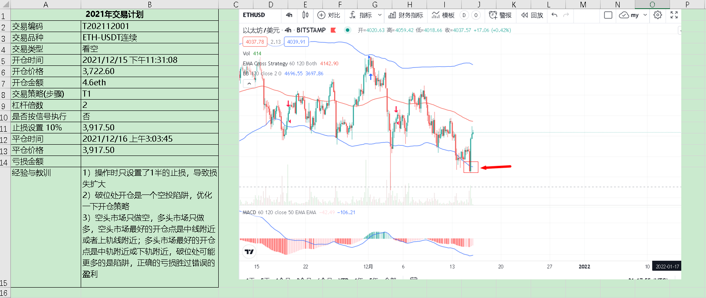
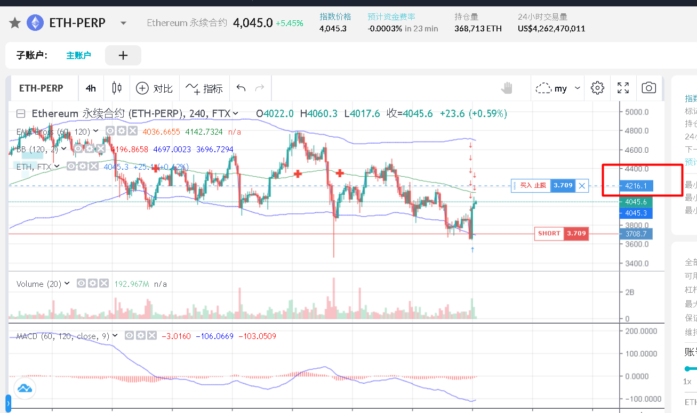

## WorkerOfCrypto的交易日记
---

### 1. 起因
从今天开始，实盘记录投机过程，看能坚持多久。

### 2. 交易日记

#### **交易计划20211215**

12.15日美联储会议结果
```
所有美联储委员均预计美联储将在明年开始加息，具体为2022和2023年分别加息三次；缩债计划：从2022年一月起，将缩减购债速度由150亿美元/月加快至300亿美元/月。此外，鲍尔默还表示，加密货币是有风险的，但目前没有看到加密货币带来的金融稳定风险，如果进行适当调节，稳定币将是有用的。
```
这难道不在意料之中吗？如果昨天的破位下行形成陷阱后的V型反转是由于这个会议的结果，那币圈的思维层次还是在第一层，完全不需要“预判你的预判”。

12.15的交易记录


#### **交易计划20211216**
目前4小时 ETH BTC 还在虚弱的空头趋势中，早上醒来继续开空仓给ETH



